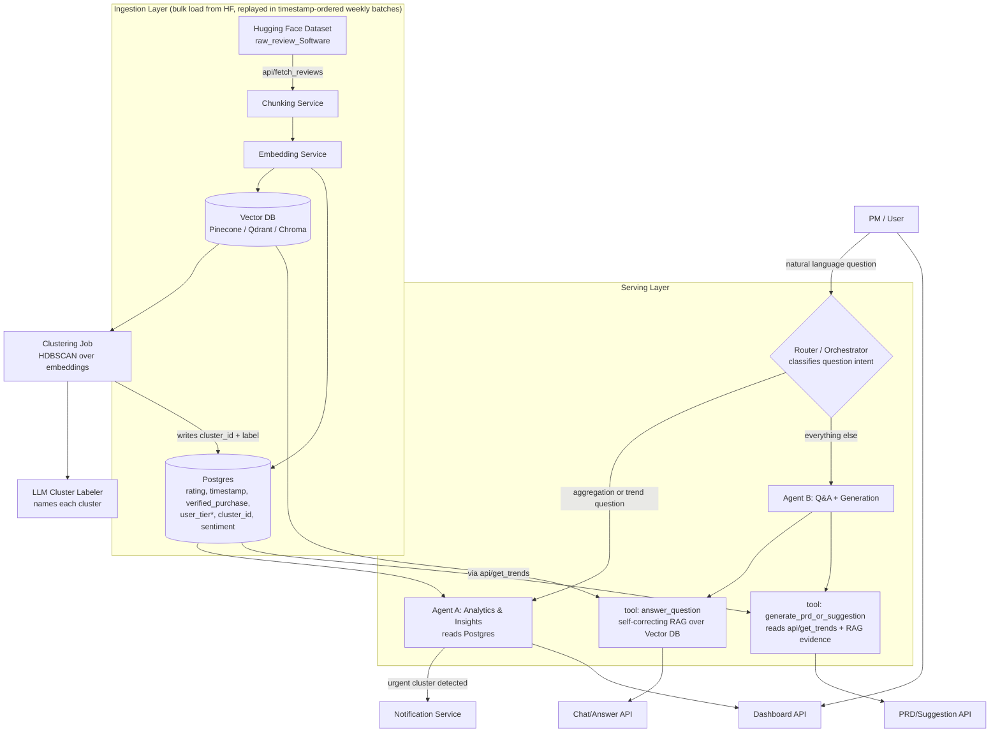

# PRD: AI Product Insights Dashboard
**Owner:** Aayushi | **Doc status:** Draft v1 | **Type:** Personal portfolio project (RAG + Multi-Agent Systems)

---

## 1. Problem Statement

PMs at consumer product companies (Spotify, Swiggy, Notion, ChatGPT-style apps) drown in unstructured review data — App Store, Play Store, Amazon, support tickets. They can't manually read thousands of reviews to answer basic questions like "what's breaking this month" or "what should we build next."

**This project builds an AI system that turns a raw review stream into three things a PM actually uses:**
1. An always-updated dashboard of complaints, categories, and trends
2. A conversational Q&A interface over the review corpus (RAG)
3. Auto-generated, structured artifacts (PRDs, prioritization suggestions) grounded in real user feedback

This is the project to position as your **flagship AI Engineer piece** — it directly demonstrates production RAG design, multi-agent orchestration, and (critically) a **self-correction loop**, which is the one gap your current portfolio (BTP chatbot, DevGenie) doesn't yet cover.

---

## 2. Goals & Non-Goals

**Goals**
- Ingest reviews on a schedule, cluster/categorize them automatically
- Answer free-text PM questions with retrieval-grounded answers, not hallucinated ones
- Surface trends and urgent issues proactively (push, not just pull)
- Generate a structured PRD draft for the top requested feature
- Be demo-able end-to-end in ~2–3 weeks of build time, with clean interview talking points

**Non-Goals (for v1)**
- Real-time streaming ingestion (polling/batch is enough — say so explicitly in the interview, don't over-engineer)
- Multi-tenant / multi-product support (single product corpus is fine)
- Fine-tuning a model — this is a retrieval + orchestration project, not a training project

---

## 3. Users & Core Use Cases

Single persona: **Product Manager**. Mapped against your five target questions:

| # | Question | Type of task | Primary owner |
|---|---|---|---|
| 1 | "Top 10 complaints this month?" | Structured aggregation over labeled clusters | Agent A (Analytics) |
| 2 | "Which feature request is growing fastest?" | Time-series trend comparison across clusters | Agent A (Analytics) |
| 3 | "Which complaints affect premium users?" | Aggregation **+ user metadata filter** | Agent A (Analytics) — **blocked by data gap, see §4** |
| 4 | "What should we prioritize next sprint?" | Reasoning over trend data + impact/effort heuristics | Agent B, `generate` tool (see §7) |
| 5 | "Generate a PRD for the most requested feature" | Structured long-form generation, grounded in reviews | Agent B, `generate` tool (see §7) |

Notice: questions 1–2 are **analytics queries** (a vector DB is the wrong tool for these — you need aggregation, not similarity search), owned by Agent A. Questions 4–5 are **generation tasks** — still Agent B, just a different tool within it than the one it uses for Q&A. Full reasoning in §7.

---

## 4. Dataset (finalized)

You're loading the `raw_review_Software` split of `McAuley-Lab/Amazon-Reviews-2023` directly from Hugging Face:

```python
from datasets import load_dataset

reviews = load_dataset(
    "McAuley-Lab/Amazon-Reviews-2023",
    "raw_review_Software",
    trust_remote_code=True
)
```

**Fields per review:** `rating` (1–5), `title`, `text`, `asin`, `parent_asin`, `user_id`, `timestamp` (second-level precision), `helpful_vote`, `verified_purchase`.

**This solves Q2 for free.** You now have a real `timestamp` on every review, so "which feature request is growing fastest" is a genuine time-series query — no synthetic date needed.

**Q3 ("premium users") is still open**, because you're loading `raw_review_Software` only, not the paired `raw_meta_Software` file. The metadata file carries a `price` field you could use as a real, non-synthetic proxy for premium/paid vs. free software — but since you're keeping this reviews-only, that's off the table for v1. Two paths:
- **Default (what this PRD assumes below):** synthesize a `user_tier` field at ingestion, same as before — just applied to real data this time. Disclose it in your README.
- **Later, if you have time:** load `raw_meta_Software` too (swap `raw_review_` → `raw_meta_`, joins on `parent_asin`), and use `price` as a genuine tier signal instead. This is a clean "v2" line for your README's future-work section.

`rating` also replaces the old binary polarity label as your sentiment bootstrap — e.g. `rating <= 2` as a first-pass "negative" flag before clustering.

---

## 5. High-Level Architecture (HLD)


*`user_tier` is synthetic unless `raw_meta_Software` is added later (§4).*

**What changed vs. your sketch, and why:**
- Ingestion source is now the **Hugging Face dataset**, not a live NoSQL store — it's a static bulk source, so "weekly polling" is simulated by replaying the data in `timestamp`-ordered batches through the same pipeline you'd use for a real feed. Worth saying exactly this in an interview: the ingestion code path is production-shaped even though the source is a static file.
- Added a **Postgres (or any structured store) alongside the vector DB.** Vector DBs are bad at "top 10 by count" or "trend over time" — that's a `GROUP BY` query, not a similarity search. This is the single most common mistake in RAG system design and calling it out explicitly is a strong interview signal.
- Added a **Router/Orchestrator** in front of your original two agents. A PM types free text — the system decides "aggregation question → Agent A" or "everything else → Agent B" before doing anything else. This is the standard **supervisor-agent pattern** in LangGraph.
- **Agent A and Agent B don't call each other.** Agent B's `generate_prd_or_suggestion` tool doesn't hop through Agent A — it just hits the same `api/get_trends` endpoint Agent A itself reads from. Both agents sit on top of the same shared data layer (Postgres + Vector DB); they don't need an agent-to-agent link. One fewer moving part to draw and defend in an interview.
- This matches your original sketch exactly: Agent A = dashboard/trends/urgency, Agent B = "ask questions, give suggestions, create PRDs" — internally a router between two tools, same as your `api/get_suggestions` note already said.

---

## 6. Data Pipeline (detail)

1. **Ingest:** Bulk-load `raw_review_Software` once, then partition by `timestamp` into weekly windows and replay through the pipeline in order — this simulates a weekly poll against a static source. For each review: assign synthetic `user_tier` (§4).
2. **Chunk:** Reviews are short, so chunk = 1 review in most cases; only split if a review exceeds ~300 tokens.
3. **Embed:** `text-embedding-3-small` (OpenAI) or `voyage-2` — either is fine and cheap at this scale.
4. **Store:** Vector DB gets `(embedding, review_id, review_text)`. Postgres gets `(review_id, review_date, user_tier, sentiment, cluster_id, cluster_label, urgency_flag)`.
5. **Cluster:** Run HDBSCAN (density-based — don't use k-means, you don't know k in advance) over embeddings weekly. New clusters trigger the LLM labeler; existing clusters get new members appended.
6. **Label & flag:** LLM assigns a human-readable category name per cluster ("Login failures", "Pricing complaints") and an urgency score based on complaint density + negative-sentiment ratio.

---

## 7. Agent Design — Is 2 Agents Enough?

**Yes. 2 agents + 1 orchestrator. Your original sketch had this right — Agent B was already designed as a multi-tool agent, not a single-purpose RAG bot.**

Here's the reasoning, use-case by use-case:

- **Agent A (Analytics/Insights)** — unchanged. It's structured queries + summarization over Postgres, with an LLM layer for cluster labeling and urgency judgment. Handles Q1–Q3.
- **Agent B (Q&A + Generation)** — this is one agent with **two internal tools**, exactly like your `api/get_suggestions` note already specified ("agent decides based on questions — do we need to answer using RAG or give suggestions and create PRDs"):
  - `answer_question` — the self-correcting RAG pipeline (§9), for genuinely open-ended semantic questions
  - `generate_prd_or_suggestion` — pulls trend data via `api/get_trends`, gathers supporting reviews via retrieval, fills a RICE-scored PRD/suggestion template
  
  Agent B itself decides which tool to invoke per question — that's an internal routing decision *within* the agent, not a reason to split it into two separate agents. This is a standard **ReAct-style tool-use agent**: one LLM reasoning loop, multiple callable tools.
- **The orchestrator sits above both agents**, not above three. It only needs to answer one question: "is this an aggregation/trend question (→ Agent A) or anything else (→ Agent B)?" Agent B's own tool-selection step handles the finer distinction between answering and generating.
- **Agent A and Agent B never call each other.** Where Agent B's generation tool needs trend numbers, it reads the same `api/get_trends` endpoint Agent A serves — both agents sit on the same shared data layer, so there's no agent-to-agent dependency to explain or debug.

**Final architecture:** exactly what you drew — Agent A, Agent B, one orchestrator in front. The only addition beyond your sketch is making Agent B's internal answer/generate branching and the self-correction loop (§9) explicit as a LangGraph tool-routing structure, since that's what turns "an agent that can do two things" into something you can defend on a whiteboard.

---

## 8. API Specification

| Endpoint | Method | Owner | Purpose |
|---|---|---|---|
| `/api/v1/ingest/reviews` | POST | Pipeline | Load next timestamp-partitioned batch from `raw_review_Software`, chunk, embed, store |
| `/api/v1/trends` | GET | Agent A | Cluster-level trend data over a time window (also read by Agent B's `generate` tool) |
| `/api/v1/complaints/top` | GET | Agent A | Top-N complaint categories by count/severity |
| `/api/v1/dashboard/summary` | GET | Agent A | Weekly rollup for the dashboard UI |
| `/api/v1/alerts/urgent` | GET/WS | Agent A | Urgent cluster notifications |
| `/api/v1/ask` | POST | Agent B (`answer_question` tool) | Free-text RAG question, self-correcting |
| `/api/v1/suggestions` | POST | Agent B (`generate_prd_or_suggestion` tool) | Ranked feature/complaint list with RICE scoring |
| `/api/v1/prd/generate` | POST | Agent B (`generate_prd_or_suggestion` tool) | Full PRD draft for a given cluster/feature |

### `POST /api/v1/ingest/reviews`
```json
// Request
{ "since": "2026-07-01T00:00:00Z", "batch_size": 5000 }

// Response
{ "ingested": 4820, "new_clusters_detected": 2, "vector_db_write_ms": 1340 }
```

### `GET /api/v1/trends?window=30d&min_growth=0.2`
```json
// Response
{
  "window": "30d",
  "trends": [
    { "cluster_id": "c_014", "label": "Dark mode request", "count": 312, "growth_rate": 0.46, "sentiment": "negative" },
    { "cluster_id": "c_009", "label": "Checkout crashes", "count": 201, "growth_rate": 0.31, "sentiment": "negative" }
  ]
}
```

### `POST /api/v1/ask`
```json
// Request
{ "question": "What are premium users complaining about most?", "filters": { "user_tier": "premium" } }

// Response
{
  "answer": "Premium users most frequently mention slow customer support response times and billing confusion after plan upgrades.",
  "confidence": "high",
  "self_correction_applied": true,
  "correction_reason": "initial retrieval had low relevance score (0.41); re-ran with query rewrite + tier filter",
  "sources": [
    { "review_id": "r_88213", "snippet_id": "s1" },
    { "review_id": "r_90441", "snippet_id": "s2" }
  ]
}
```

### `POST /api/v1/prd/generate`
```json
// Request
{ "cluster_id": "c_014" }

// Response
{
  "title": "PRD: Dark Mode",
  "problem_statement": "312 reviews over 30 days request dark mode, growth rate 46% — highest of any open request.",
  "supporting_evidence": ["r_10231", "r_44012", "r_50291"],
  "priority_score": { "reach": 8, "impact": 6, "confidence": 9, "effort": 4, "rice": 108 },
  "proposed_scope": "..."
}
```

---

## 9. Self-Correcting RAG Design (this is the section that fills your portfolio gap)

Standard RAG: retrieve top-k → generate answer. This fails silently when retrieval is weak — the model just hallucinates confidently over irrelevant chunks. Corrective/self-correcting RAG (CRAG pattern) adds a checkpoint:

1. **Retrieve** top-k chunks for the query (hybrid: vector similarity + Postgres metadata filters like `user_tier`)
2. **Grade relevance** — a cheap LLM call or classifier scores retrieved chunks as relevant / ambiguous / irrelevant
3. **Branch:**
   - *Relevant* → generate answer directly
   - *Ambiguous* → rewrite the query (query expansion/decomposition) and re-retrieve once
   - *Irrelevant* → widen the search (drop filters, broaden cluster scope) or return "insufficient data" rather than hallucinate
4. **Generate** the answer with citations to `review_id`s
5. **Self-check** (optional but strong for your resume) — a final LLM pass checks the generated answer against the retrieved chunks for unsupported claims before returning

Implement this as a LangGraph graph with explicit nodes (`retrieve → grade → [rewrite → retrieve] → generate → verify`) rather than a single prompt — the explicit graph structure is what you want to be able to draw on a whiteboard in an interview.

---

## 10. Data Model

**Postgres**
```sql
CREATE TABLE reviews (
  review_id UUID PRIMARY KEY,
  asin VARCHAR(20),
  parent_asin VARCHAR(20),
  review_text TEXT,
  rating SMALLINT,              -- real field from raw_review_Software
  review_date DATE,             -- derived from real `timestamp` field
  verified_purchase BOOLEAN,    -- real field
  helpful_vote INT,             -- real field
  user_tier VARCHAR(20),        -- synthetic, see §4
  sentiment VARCHAR(10),        -- derived: rating <= 2 = negative, else positive
  cluster_id VARCHAR(20),
  urgency_flag BOOLEAN DEFAULT FALSE
);
CREATE INDEX idx_reviews_cluster ON reviews(cluster_id, review_date);
```

**Vector DB payload:** `{ review_id, embedding, review_text, cluster_id, review_date, user_tier }` — store metadata alongside the vector so you can pre-filter before similarity search (most vector DBs support this natively).

---

## 11. Tech Stack

- **Orchestration:** LangGraph (matches your existing experience — reuse it)
- **Vector DB:** Qdrant or Chroma (free, self-hostable, good for a portfolio demo — Pinecone works too if you want the managed-service line on your resume)
- **Structured DB:** Postgres (or SQLite for a lightweight demo)
- **Embeddings:** OpenAI `text-embedding-3-small`
- **Clustering:** HDBSCAN (`scikit-learn`/`hdbscan` package)
- **Backend:** FastAPI (matches your existing stack)
- **Dashboard:** simple React front-end, or even Streamlit for speed

---

## 12. Non-Functional Requirements

- Ingestion job idempotent (re-running shouldn't duplicate embeddings — dedupe on `review_id`)
- `/ask` endpoint p95 latency target: under 4s including the self-correction loop
- All generated answers must carry source `review_id` citations — no ungrounded claims

---

## 13. Suggested Build Plan (portfolio timeline)

| Phase | Scope | Est. time |
|---|---|---|
| 1 | Ingestion + chunk + embed + vector DB + Postgres | 2–3 days |
| 2 | Clustering + LLM labeling + Agent A endpoints | 2–3 days |
| 3 | Agent B basic RAG, then add CRAG self-correction loop | 3–4 days |
| 4 | Router + Agent B's `generate_prd_or_suggestion` tool | 2 days |
| 5 | Minimal dashboard UI + README with architecture diagram | 2 days |

~2 weeks total, buildable alongside interview prep.

---

## 14. Open Risks

- **Dataset gap (§4)** — Q2 is now solved by the real `timestamp` field. Q3 (premium users) still relies on a synthetic `user_tier` unless you add `raw_meta_Software` for a real `price`-based proxy — disclose the synthetic field in your README either way
- Cluster count will drift over time — decide a re-clustering cadence (weekly full re-cluster is simplest for v1)
- LLM-as-judge relevance grading (step 2 of CRAG) adds cost/latency per query — fine for a demo, worth mentioning as a known tradeoff if asked
